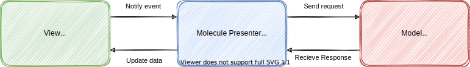

<h1 align="center">
    Jetpack-Compose-Molecule-Demo
</h1>

<h3 align="center">
    !! This application is created with reference to the Molecule sample application !!
    https://github.com/cashapp/molecule/tree/trunk/sample
</h3>

<h3 align="center">
    
</h3>


## ✨Features

This application has next features.

- Count numbers.
- Randomize numbers.

## 🏢Implementation

This application is implemented by molecule.



### View(Jetpack Compose UI)

```kotlin
class MainActivity : ComponentActivity() {
    private val scope = CoroutineScope(Main)
    private val randomService = RandomService.create()

    override fun onCreate(savedInstanceState: Bundle?) {
        super.onCreate(savedInstanceState)

        val event = MutableSharedFlow<CounterEvent>()
        val modelFlow: Flow<CounterModel> = scope.launchMolecule(mode = RecompositionMode.Immediate) {
            CounterPresenter(event, randomService)
        }

        setContent {
            CounterApp(
                modelFlow = modelFlow,
                onIncreaseOne = { scope.launch { event.emit(Change(1)) } },
                onIncreaseTen = { scope.launch { event.emit(Change(10)) } },
                onDecreaseOne = { scope.launch { event.emit(Change(-1)) } },
                onDecreaseTen = { scope.launch { event.emit(Change(-10)) } },
                onRandomize = { scope.launch { event.emit(Randomize) } }
            )
        }
    }
}

@Composable
fun CounterApp(
    modelFlow: Flow<CounterModel>,
    onIncreaseOne: () -> Unit,
    onIncreaseTen: () -> Unit,
    onDecreaseOne: () -> Unit,
    onDecreaseTen: () -> Unit,
    onRandomize: () -> Unit
) {
    val model by modelFlow.collectAsState(CounterModel())

    Column {
        Box(
            modifier = Modifier
                .fillMaxWidth()
                .size(150.dp)
                .align(Alignment.CenterHorizontally)
        ) {
            if (model.loading) {
                CircularProgressIndicator(
                    modifier = Modifier
                        .size(100.dp)
                        .align(Alignment.Center)
                )
            } else {
                Text(
                    text = model.value.toString(),
                    fontSize = 100.sp,
                    textAlign = TextAlign.Center,
                    modifier = Modifier
                        .fillMaxWidth()
                        .align(Alignment.Center)
                )
            }
        }

        Button(onClick = onIncreaseOne, modifier = Modifier.fillMaxWidth()) {
            Text(text = "INCREASE ONE")
        }

        Button(onClick = onIncreaseTen, modifier = Modifier.fillMaxWidth()) {
            Text(text = "INCREASE TEN")
        }

        Button(onClick = onDecreaseOne, modifier = Modifier.fillMaxWidth()) {
            Text(text = "DECREASE ONE")
        }

        Button(onClick = onDecreaseTen, modifier = Modifier.fillMaxWidth()) {
            Text(text = "DECREASE TEN")
        }

        Button(onClick = onRandomize, modifier = Modifier.fillMaxWidth()) {
            Text(text = "RANDOMIZE")
        }
    }
}
```

### Molecule Presenter(Using Jetpack Compose)

```kotlin
sealed interface CounterEvent
data class Change(val delta: Int) : CounterEvent
object Randomize : CounterEvent

data class CounterModel(
    val value: Int = 0,
    val loading: Boolean = false,
)

@Composable
fun CounterPresenter(
    events: Flow<CounterEvent>,
    randomService: RandomService,
): CounterModel {
    var count by remember { mutableStateOf(0) }
    var loading by remember { mutableStateOf(false) }

    LaunchedEffect(Unit) {
        events.collect { event ->
            when (event) {
                is Change -> {
                    count += event.delta
                }

                Randomize -> {
                    loading = true
                    launch {
                        count = randomService.get(-20, 20)
                        loading = false
                    }
                }
            }
        }
    }

    return CounterModel(count, loading)
}
```

### Model(HTTP Client)

```kotlin
interface RandomApi {
    @GET("integers/?num=1&col=1&base=10&format=plain")
    suspend fun get(
        @Query("min") min: Int,
        @Query("max") max: Int,
    ): String
}

interface RandomService {
    suspend fun get(min: Int, max: Int): Int
    companion object {
        fun create(): RandomService {
            val retrofit = Retrofit.Builder()
                .baseUrl("https://www.random.org/")
                .client(
                    OkHttpClient.Builder()
                        .addInterceptor(
                            HttpLoggingInterceptor { Log.d("HTTP", it) }
                                .also { it.level = HttpLoggingInterceptor.Level.BASIC },
                        )
                        .build(),
                )
                .addConverterFactory(ScalarsConverterFactory.create())
                .build()

            val api = retrofit.create<RandomApi>()

            return object : RandomService {
                override suspend fun get(min: Int, max: Int): Int {
                    return api.get(min, max).trim().toInt()
                }
            }
        }
    }
}

```

## 📚Library

This application uses the libraries below.

| Name                  | Link                                                         |
| --------------------- | ------------------------------------------------------------ |
| Jetpack Compose       | https://developer.android.com/jetpack/compose                |
| Molecule              | https://github.com/cashapp/molecule                          |
| OkHttp                | https://square.github.io/okhttp/                             |
| Retrofit              | https://square.github.io/retrofit/                           |

## ⭐Reference

| Name                                                         | Link                                                         |
| ------------------------------------------------------------ | ------------------------------------------------------------ |
| Molecule \| README | https://github.com/cashapp/molecule/blob/trunk/README.md |

## 💡License

```
Copyright (c) 2022 Yusuke Katsuragawa

Permission is hereby granted, free of charge, to any person obtaining a copy
of this software and associated documentation files (the "Software"), to deal
in the Software without restriction, including without limitation the rights
to use, copy, modify, merge, publish, distribute, sublicense, and/or sell
copies of the Software, and to permit persons to whom the Software is
furnished to do so, subject to the following conditions:

The above copyright notice and this permission notice shall be included in all
copies or substantial portions of the Software.

THE SOFTWARE IS PROVIDED "AS IS", WITHOUT WARRANTY OF ANY KIND, EXPRESS OR
IMPLIED, INCLUDING BUT NOT LIMITED TO THE WARRANTIES OF MERCHANTABILITY,
FITNESS FOR A PARTICULAR PURPOSE AND NONINFRINGEMENT. IN NO EVENT SHALL THE
AUTHORS OR COPYRIGHT HOLDERS BE LIABLE FOR ANY CLAIM, DAMAGES OR OTHER
LIABILITY, WHETHER IN AN ACTION OF CONTRACT, TORT OR OTHERWISE, ARISING FROM,
OUT OF OR IN CONNECTION WITH THE SOFTWARE OR THE USE OR OTHER DEALINGS IN THE
SOFTWARE.
```
